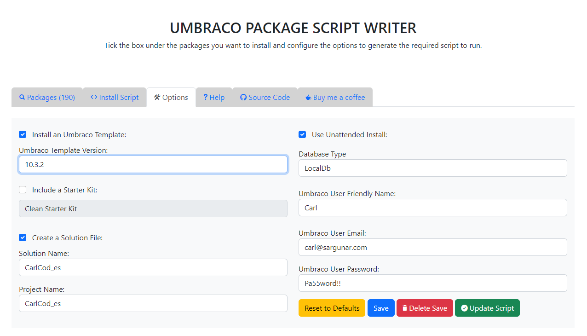

# Building Carlcod_es

## Install Umbraco

Using https://psw.codeshare.co.uk/ generate a script for a clean Umbraco install. I used the following settings:

Which results in the following install script

    # Ensure we have the latest Umbraco templates
    dotnet new -i Umbraco.Templates::10.3.2

    # Create solution/project
    dotnet new sln --name "CarlCod_es"
    dotnet new umbraco -n "CarlCod_es" --friendly-name "Carl" --email "carl@sargunar.com" --password "Pa55word!!" --development-database-type LocalDB
    dotnet sln add "CarlCod_es"

    dotnet run --project "CarlCod_es"
    #Running

Once you've verified the project works, we'll add a new project, and a nuget project

